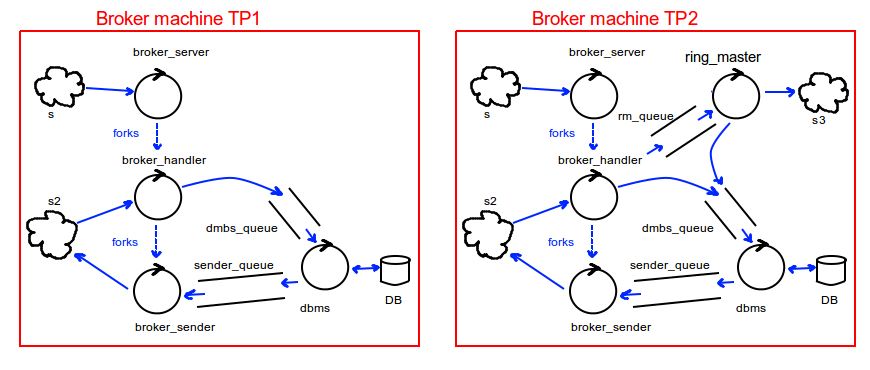
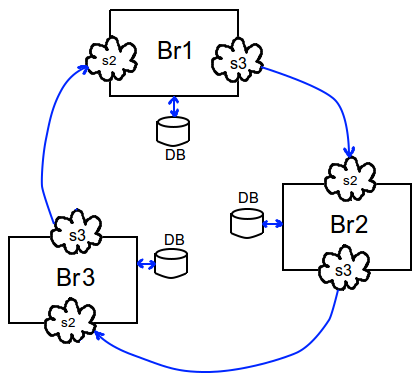
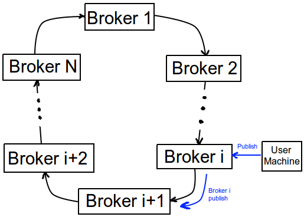
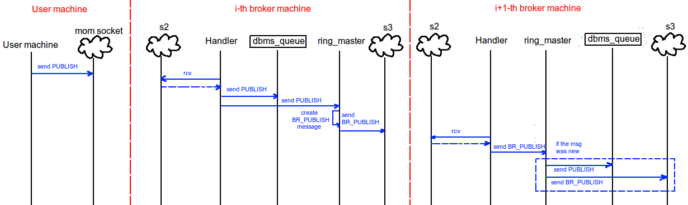

# MOM TP2 for Sistemas Distribuidos I (FIUBA)

## Architecture overview

​	In order to distribute the broker created on TP1, some few changes had to be made. Below is the diagram of a broker machine comparing architecture on TP1 and TP2 (note every controller is a separate process):

​	Basically we see a new controller is added, the broker _ring_master_. This process has the very important task to communicate with **another** instance of the broker, running on another machine, thus making a logically-connected broker ring. Long story short, every broker instance will have a _ring_master_ process which will communicate with a _broker_handler_ and _brokser_sender_ duo of another broker instance, on another machine.

​	For instance, consider a three-brokered ring token as follows:

​	We can easily see every _ring_master_ is connected via socket _s3_ to a socket _s2_ on the next broker machine, being able then to forward messages as a user machine would do.

## Assumptions and other notes

​	The next things were considered for this implementation:

- Every broker machine has its own users and topics' database. Then, the database in every broker machine **is** different. This lack of global consistency makes the implementation rather easy, compared to another implementation able to maintain a global state of the database (i.e. the user machines registered in one broker instance are known in all broker instances). As I saw no purpose in mainting this global consistency (after all, _why_ would I ever want a broker machine to know all users? If the same user registered in some broker instance ever wishes to connect against another broker instance, they'll receive a new global id from that other instance and that's all), I chose simplicity over complexity.
- The broker instances must be launched **in order**, as they need to create that logical ring of connections in some manner. In my implementation, the last broker of the ring assumes all the previous ones were already launched, and connects with the first one, which in turn will connect to the second and so on. This could have been replaced by a multicast messaging, and would be a nice thing to have.
- Since a broker instance **cannot** distinguish between a message from a user machine or another broker instance (because both broker instances and user machines connects to other brokers via the _broker_handler_ and _broker_sender_ duo), this needed difference derivated in new message types.
- The next strong hypothesis was used: a user machine **can only connect with one broker instance at a time**. If this weren't true, then the user would have to choose which broker instance they want to connect via the MOM API, also forcing their local _mom_daemon_ to maintain more than just one connection, making things too nasty for programming. 

## Working flow

​	Now the explanative part: how does this work? First of all, recalling the MOM API all users have available, it's simple to notice that **only publishing can involve more than one broker instance** (as receiving happens at the user machine, and calls to create, destroy, subscribe and unsubscribe have effect on only one broker database). As such, only the publishing case needs to be covered on this explanation.

​	Consider a ring of N broker instances, where the i-th broker receives a publish from a user machine as depicted in the figure below:

​	Remember the first picture comparing the architecture of TP1 and TP2. In TP1 implementation, the _broker_handler_ related to that user machine receives the request message, and then pushes it into the _dbms_queue_. The _dbms_ process then pulls that request, forks a worker and forwards that message to as many _broker_sender_ processes as needed. That part stays the same in TP2 implementation. However, we **also need _ring_master_ to forward the same message to the next broker instance in the ring**. In order to achieve that, in TP2 implementation the _broker_handler_ also pushes the message in a _rm_queue_, reaching the _ring_master_ of that broker instance. 

​	Once the _ring_master_ has the publish request, it can send the same request to the next broker instance in the ring. The next broker instance gets that publish request in one of its own _broker_handler_ processes, and the whole cycle starts again. This way, every _ring_master_ can get requests from the previous broker instance in the ring, and forward them to the next instance. One problem shows at hand, though: when and how does this stop? In my implementation, once the _ring_master_ gets a publish request, it must validate that such request has never passed through it before. If it has, then there's no sense in forwarding again: it has already travelled along the whole ring. However, we also need to prevent one little thing too: the _broker_handler_ **cannot** forward the same publish request to the _dbms_ twice (or the subscribed users could receive the same message duplicated). The only way of solving that is **preventing the _broker_handler_ from pushing publish requests into the _dbms_queue_ if they came from another broker instance**. That job is delegated on the _ring_master_ (and that's why it can push requests into the _dbms_queue_), as it's the only one that can know if that publish request was on that broker before or not.

​	The flow is summed up in the next sequence diagram:

