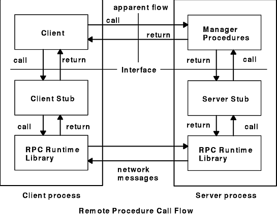

# RPC: Remote Procedure Calls (_in a nutshell_)


## Introducción


> _"The idea of remote procedure calls is quite simple"_
>
> ​	- Birrell, Andrew


​	Una de las primeras cosas que aprende aquél que se inicia en este oscuro arte de la programación es la modularización de programas mediante procedimientos o funciones. Los mismos permiten al programador dividir su gran problema a resolver en varios problemas más pequeños que pueden atacarse por separado, facilitando así la comprensión de la situación y generando un nuevo nivel de abstracción. No obstante, las ventajas de esta modularización basada en procedimientos comienzan a perderse cuando las aplicaciones migran hacia los ambientes distribuidos. 

​	La filosofía de Remote Procedure Calls (de aquí en más, RPC) busca extender el uso de llamadas a procedimientos a los sistemas distribuidos, permitiendo al programador comunicarse con un host remoto a través de una red manteniendo la ya conocida interfaz de invocaciones a funciones. En este archivo .md buscaremos explicar las ventajas del uso de RPC, así como su esquema de implementación. 


## Motivación

​	En su artículo de 1984, Birrell y Nelson expresan:


> _"The primary purpose of RPC project was to make distributed computation easy."_


​	El problema que ellos veían (y que les hacía afirmar tal cosa como la complejidad de los ambientes distribuidos) era que los mecanismos de comunicación de procesos eran el "factor limitante" en el desarrollo de aplicaciones distribuidas. Así, RPC permitiría independizar a los programadores de éstos mecanismos, y de los fallos más habituales que ellos conllevan.


## Estructura

La estructura de RPC permite definir la interfaz de los métodos a través de un lenguaje de especificación denominado IDL (Interface Definition Language). A partir de esta especificación se generan dos piezas de código denominadas _stubs_. Los _stubs_ encapsulan toda la lógica de comunicación entre los procesos remotos así como la serialización de los datos; y proveen al usuario con una API de los métodos tal y como si los llamara localamente. 




* Client & Server: es el código que escribe el usuario, tanto del lado del cliente como del servidor, y que se enlaza con el 

* Client-stub & server-stub: código autogenerado.

* RPC runtime: librería común de RPC que encapsula el manejo de la red y la serialización de los argumentos y respuesta de los llamados.

  ​


## Ejemplo sencillo

​	Para mostrar la magia de RPC, pudimos implementar un único y sencillo procedimiento remoto para funcionar como un contador. La firma de este método, tal y como fuera vista por el cliente, es:

```c
int* print_hola_1(void);
```

​	Para esto, se usó un archivo de especificación IDL `hola.x`  y el comando `rpcgen` para generar automáticamente los stubs de cliente y servidor, y un esqueleto de programa principal para ambos. El ya mencionado `hola.x`contenía lo siguiente:

```idl
program display_prg 
{ 
  version display_ver
  {
    int print_hola (void) = 1;
  } = 1;
} = 0x20000001;

```

​	Donde se puede apreciar a la función `print_hola`que no recibe argumentos y devuelve una variable tipo `int`, similar a la firma de la función buscada. Para generar el resto de los archivos del programa se usó:

```bash
$ rpcgen -a hola.x
```

​	El resultado de esta ejecución fueron cinco archivos de código autogenerado (además de un archivo `Makefile` para compilarlos), los cuales se listan a continuación:

- *Archivo `hola.h`*: Archivo de cabecera a incluir por el cliente, el servidor y sus stubs. Incluye las definiciones de las funciones del código autogenerado (entre ellas, la deseada`print_hola_1`según cómo la ve el cliente)

- *Archivos `hola_clnt.c` y `hola_svc.c`*: Archivos respectivos de los stubs de cliente y servidor. En ellos se puede apreciar el marshalling de los parámetros a formato XDR.

- *Archivo `hola_server.c`*: Estructura autogenerada para la implementación de la función remota en el servidor. Básicamente, en este archivo se puede definir el código que se desea lograr con la función `print_hola_1`. Como en nuestro caso buscábamos implementar un contador, el código en este archivo resultó ser el siguiente:

  ```c
  /*
   * This is sample code generated by rpcgen.
   * These are only templates and you can use them
   * as a guideline for developing your own functions.
   */

  #include "hola.h"
  #include <stdio.h>

  int *
  print_hola_1_svc(void *argp, struct svc_req *rqstp)
  {
  	static int  result;

  	/*
  	 * insert server code here
  	 */

  	pritnf("Hello RPC World!!!\n");
  	result++;

  	return &result;
  }
  ```

  ​

- *Archivo `hola_client.c`*: Estructura similar a la anterior, pero para la implementación del cliente. El código autogenerado original ya contenía una invocación remota a nuestra función, por lo que sólo agregamos un `printf` para poder visualizar el resultado de dicho llamado: 

```c
/*
 * This is sample code generated by rpcgen.
 * These are only templates and you can use them
 * as a guideline for developing your own functions.
 */

#include "hola.h"
#include <stdio.h>

void
display_prg_1(char *host)
{
	CLIENT *clnt;
	int  *result_1;
	char *print_hola_1_arg;

#ifndef	DEBUG
	clnt = clnt_create (host, display_prg, display_ver, "udp");
	if (clnt == NULL) {
		clnt_pcreateerror (host);
		exit (1);
	}
#endif	/* DEBUG */

	result_1 = print_hola_1((void*)&print_hola_1_arg, clnt);
	if (result_1 == (int *) NULL) {
		clnt_perror (clnt, "call failed");
	}
	// Print result
	printf("Result is: %d\n", *result_1);
#ifndef	DEBUG
	clnt_destroy (clnt);
#endif	 /* DEBUG */
}


int
main (int argc, char *argv[])
{
	char *host;

	if (argc < 2) {
		printf ("usage: %s server_host\n", argv[0]);
		exit (1);
	}
	host = argv[1];
	display_prg_1 (host);
exit (0);
}
```

​	Compilando tanto cliente como servidor con el mismo `Makefile `provisto, fue posible generar los binarios ejecutables de cliente y servidor. Sin embago, como un adicional, fue necesario utilizar el comando `rpcbind`en el host del servidor para poder realizar el mappeo de puertos correcto:

```bash
$ rpcbind -h "157.92.50.254"
$ ./hola_server
```

​	En el host del cliente, el mismo puede ejecutarse sin problemas como cualquier aplicación, pasando como parámetro la dirección IP del servidor. Como resultado de la ejecución, se puede ver que el contador remoto, efectivamente, cuenta:

```bash
$ ./hola_client "157.92.50.253"
Result is: 1
$ ./hola_client "157.92.50.253"
Result is: 2
```


### Comparaciones de tiempos

​	Para poder observar el retardo introducido por la red en estas llamadas a invocaciones remotas, se decidió además implementar el mismo contador de forma local con el fin de contrastar el tiempo de ejecución en ambos casos. Así, se corrieron 10000 llamadas en ambos casos (procedimiento remoto y local) para poder medir un tiempo promedio de ejecución de los mismos. Los resultados fueron:

- 1.83 ms por ejecución de procedimiento remoto
- 0.73 ms por ejecución local